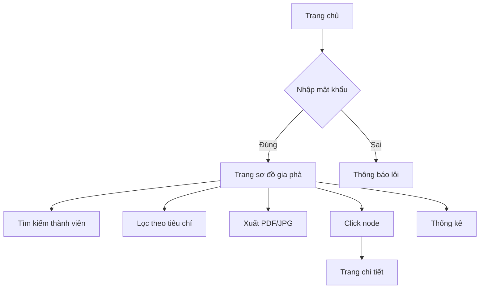

## 1. Tổng quan sản phẩm

Ứng dụng web Gia Phả là công cụ trực quan hóa thông tin gia phả từ Google Sheets, giúp người dùng dễ dàng xem và tìm hiểu cấu trúc gia đình thông qua sơ đồ cây tương tác. Sản phẩm giải quyết vấn đề quản lý và truy xuất thông tin gia phả phức tạp, phù hợp cho các dòng họ cần lưu trữ và chia sẻ thông tin gia đình.

## 2. Tính năng cốt lõi

### 2.1 Vai trò người dùng
| Vai trò | Phương thức truy cập | Quyền hạn |
|---------|---------------------|-----------|
| Người xem | Truy cập qua link/mật khẩu | Xem sơ đồ gia phả, tìm kiếm, xuất file |
| Quản trị viên | Đăng nhập qua Google OAuth | Cập nhật dữ liệu, quản lý quyền truy cập |

### 2.2 Module chức năng
Ứng dụng bao gồm các trang chính sau:
1. **Trang chủ**: Giới thiệu, nhập mật khẩu truy cập, hướng dẫn sử dụng.
2. **Trang sơ đồ gia phả**: Hiển thị cây gia phả tương tác, tìm kiếm, lọc, thống kê.
3. **Trang thông tin chi tiết**: Hiển thị thông tin đầy đủ khi click vào thành viên.

### 2.3 Chi tiết từng trang
| Tên trang | Module | Mô tả chức năng |
|-----------|---------|------------------|
| Trang chủ | Form nhập mật khẩu | Nhập mật khẩu để truy cập, hiển thị lỗi khi sai |
| Trang chủ | Hướng dẫn | Hướng dẫn cách sử dụng và cập nhật dữ liệu |
| Sơ đồ gia phả | Cây gia phả | Hiển thị dạng cây với node tương tác, zoom, pan |
| Sơ đồ gia phả | Thanh tìm kiếm | Tìm theo tên, lọc theo thế hệ, giới tính |
| Sơ đồ gia phả | Thống kê | Hiển thị số lượng thành viên theo thế hệ |
| Sơ đồ gia phả | Xuất file | Xuất PDF/JPG của sơ đồ hiện tại |
| Chi tiết | Thông tin thành viên | Hiển thị tên, ngày sinh/mất, nghề nghiệp, địa chỉ |

## 3. Luồng hoạt động chính

**Luồng người dùng:**
1. Truy cập trang chủ → Nhập mật khẩu → Xem sơ đồ gia phả
2. Tìm kiếm thành viên → Click node → Xem thông tin chi tiết
3. Sử dụng chức năng lọc → Xuất file PDF/JPG

**Luồng quản trị:**
1. Đăng nhập Google → Cập nhật Google Sheets → Dữ liệu tự động đồng bộ

## 4. Thiết kế giao diện

### 4.1 Phong cách thiết kế
- **Màu chủ đạo**: Nâu gỗ (#8B4513) - tạo cảm giác truyền thống
- **Màu phụ**: Be nhạt (#F5F5DC) - nền sáng dễ đọc
- **Button**: Bo tròn 8px, shadow nhẹ, màu nâu đậm
- **Font**: Roboto, kích thước 14-16px cho nội dung chính
- **Layout**: Card-based, navigation đơn giản ở đầu trang
- **Icon**: Phong cách line icon màu nâu đồng bộ

### 4.2 Tổng quan thiết kế từng trang
| Tên trang | Module | Thiết kế giao diện |
|-----------|---------|---------------------|
| Trang chủ | Form mật khẩu | Input trung tâm, button nâu đậm, background gradient be |
| Sơ đồ gia phả | Cây gia phả | Fullscreen, node màu nâu nhạt, line màu xám, controls góc trên |
| Sơ đồ gia phả | Thanh tìm kiếm | Top bar với input và dropdown filter, màu nền trắng |
| Chi tiết | Modal thông tin | Popup trung tâm, bo tròn 12px, shadow đậm, chia section rõ ràng |

### 4.3 Responsive
- **Desktop-first**: Thiết kế cho màn hình 1920x1080 trước
- **Mobile-adaptive**: Breakpoint 768px, cây gia phả tự động co giãn
- **Touch optimization**: Node lớn hơn 44px cho mobile, swipe để di chuyển

### 4.4 Hướng dẫn scene 3D (nếu áp dụng)
Không áp dụng cho sản phẩm này - sử dụng 2D tree visualization.

## 5. Thiết kế dữ liệu

### 5.1 Cấu trúc Google Sheet (mặc định)
- Sheet “Thành viên” với các cột:
  - A: ID
  - B: Họ tên đầy đủ
  - C: Ngày sinh
  - D: Ngày mất
  - E: Giới tính (“Nam”/“Nữ”)
  - F: ID cha/mẹ (để trống nếu là gốc)
  - G: Cấp thế hệ (số)
  - H: Thông tin thêm (nghề nghiệp/địa chỉ/ghi chú)
  - I: ID vợ/chồng (tùy chọn, nhập ID của người phối ngẫu; khuyến nghị điền đối xứng)

Ràng buộc dữ liệu:
- ID duy nhất, không để trống.
- ID cha/mẹ và ID vợ/chồng, nếu có, phải trỏ tới ID tồn tại.
- Không tự trỏ chính mình.

### 5.2 Mô hình hóa hôn nhân (mở rộng)
- Tạo Sheet “Hôn nhân”:
  - MarriageID | Spouse1ID | Spouse2ID | StartDate | EndDate | Ghi chú
- Hỗ trợ nhiều cuộc hôn nhân theo thời gian cho một người.
- Ứng dụng hiện ưu tiên phương án đơn giản (cột “ID vợ/chồng”). Phương án mở rộng được dự phòng cho phiên bản tiếp theo.

## 6. Tiêu chí chấp nhận (Acceptance Criteria)
- Đọc được dữ liệu từ Google Sheets với RANGE `Sheet1!A:I`, bỏ qua dòng tiêu đề.
- Chuyển đổi danh sách phẳng thành cây phân cấp theo “ID cha/mẹ”.
- Hiển thị dấu hiệu hôn phối trên node khi có “ID vợ/chồng”.
- Tìm kiếm theo tên hiển thị kết quả highlight.
- Xuất được ảnh PNG và PDF sơ đồ hiện tại.
- Giao diện responsive, thao tác zoom/pan mượt trên desktop và mobile.
