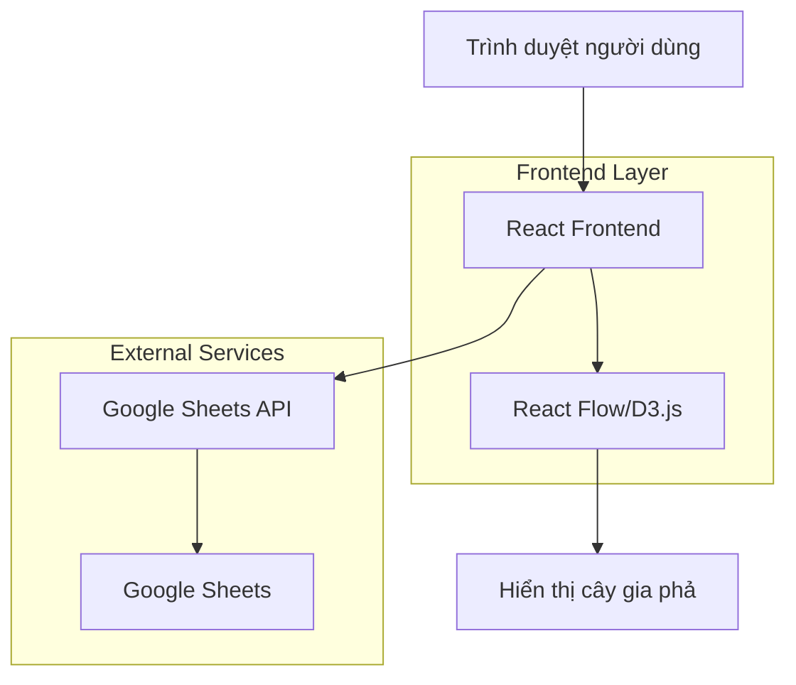

## 1. Thiết kế kiến trúc



## 2. Mô tả công nghệ

- **Frontend**: React@18 + tailwindcss@3 + vite
- **Công cụ khởi tạo**: vite-init
- **Thư viện visualization**: React Flow (ưu tiên) hoặc D3.js/vis.js
- **Backend**: Không có - xử lý hoàn toàn ở frontend
- **Xác thực**: Google Sheets API với API key hoặc OAuth 2.0
- **Xuất file**: html2canvas + jsPDF

## 3. Định nghĩa route

| Route | Mục đích |
|-------|----------|
| / | Trang chủ - nhập mật khẩu truy cập |
| /family-tree | Trang sơ đồ gia phả chính |
| /member/:id | Trang chi tiết thành viên (modal hoặc trang riêng) |

## 4. Định nghĩa API

### 4.1 Google Sheets API Integration

**Đọc dữ liệu từ Google Sheets:**
```
GET https://sheets.googleapis.com/v4/spreadsheets/{SPREADSHEET_ID}/values/{RANGE}
```

**Tham số request:**
| Tên tham số | Kiểu | Bắt buộc | Mô tả |
|-------------|------|----------|--------|
| SPREADSHEET_ID | string | true | ID của Google Sheet |
| RANGE | string | true | Phạm vi dữ liệu (ví dụ: 'Sheet1!A:I') |
| key | string | true | API key hoặc access token |

**Response format:**
```json
{
  "range": "Sheet1!A1:I100",
  "majorDimension": "ROWS",
  "values": [
    ["ID", "Họ tên", "Ngày sinh", "Ngày mất", "Giới tính", "ID cha/mẹ", "Cấp thế hệ", "Thông tin thêm", "ID vợ/chồng"],
    ["1", "Nguyễn Văn A", "01/01/1950", "", "Nam", "", "1", "Gốc họ", "2"],
    ["2", "Trần Thị B", "02/02/1952", "", "Nữ", "", "1", "Vợ ông A", "1"]
  ]
}
```

### 4.2 Xử lý dữ liệu client-side

**Chuyển đổi dữ liệu phẳng sang cây:**
```typescript
interface FamilyMember {
  id: string;
  name: string;
  birthDate: string;
  deathDate?: string;
  gender: 'Nam' | 'Nữ';
  parentId?: string;
  generation: number;
  additionalInfo: string;
  spouseId?: string; // Tùy chọn: liên kết hôn nhân đơn giản
  children: FamilyMember[];
}

function buildFamilyTree(data: string[][]): FamilyMember[] {
  // Implementation: chuyển đổi mảng 2D sang cây phân cấp
}
```

## 5. Kiến trúc server

Không áp dụng - ứng dụng hoàn toàn client-side với Google Sheets API.

## 6. Mô hình dữ liệu

### 6.1 Cấu trúc Google Sheet

| Cột | Tên trường | Kiểu dữ liệu | Mô tả |
|-----|------------|--------------|--------|
| A | ID | string | Mã định danh duy nhất |
| B | Họ tên đầy đủ | string | Tên đầy đủ của thành viên |
| C | Ngày sinh | string | Định dạng DD/MM/YYYY |
| D | Ngày mất | string | Định dạng DD/MM/YYYY, có thể để trống |
| E | Giới tính | string | "Nam" hoặc "Nữ" |
| F | ID cha/mẹ | string | ID của cha/mẹ, để trống nếu là thế hệ gốc |
| G | Cấp thế hệ | number | Số thứ tự thế hệ |
| H | Thông tin thêm | string | Nghề nghiệp, địa chỉ, ghi chú |
| I | ID vợ/chồng | string | ID người phối ngẫu (tùy chọn) |

### 6.2 Cấu trúc dữ liệu internal

```typescript
interface FamilyNode {
  id: string;
  data: {
    name: string;
    birthDate: string;
    deathDate?: string;
    gender: 'Nam' | 'Nữ';
    generation: number;
    additionalInfo: string;
    spouseId?: string;
  };
  position?: { x: number; y: number };
  style?: {
    background: string;
    border: string;
    color: string;
  };
}

interface FamilyEdge {
  id: string;
  source: string;
  target: string;
  type: 'parent-child' | 'spouse';
}
```

### 6.3 Google Sheets Configuration

**Cách thiết lập Google Sheets API:**
1. Tạo project trong Google Cloud Console
2. Bật Google Sheets API
3. Tạo API key hoặc OAuth 2.0 credentials
4. Share Google Sheet với service account (nếu dùng service account)
5. Lấy SPREADSHEET_ID từ URL

**Sample Google Sheet template:**
```
https://docs.google.com/spreadsheets/d/[SPREADSHEET_ID]/edit#gid=0
```

**Environment variables cần thiết:**
```
VITE_GOOGLE_SHEETS_API_KEY=your_api_key_here
VITE_SPREADSHEET_ID=your_spreadsheet_id_here
```

### 6.4 Mô hình hóa quan hệ hôn nhân
- Cách đơn giản (mặc định): sử dụng cột I “ID vợ/chồng” trong Sheet thành viên. Nhập ID của người phối ngẫu; khuyến nghị điền đối xứng ở cả hai người.
- Cách mở rộng: tạo thêm Sheet “Hôn nhân” với các cột: `MarriageID`, `Spouse1ID`, `Spouse2ID`, `StartDate`, `EndDate`, `Ghi chú`. Cho phép một người có nhiều hôn nhân theo thời gian. Khi đó sinh thêm edges `type: 'spouse'` giữa các cặp.
- Con cái vẫn liên kết qua “ID cha/mẹ” (hoặc có thể tách thành “ID cha”, “ID mẹ” nếu muốn chính xác hơn).
